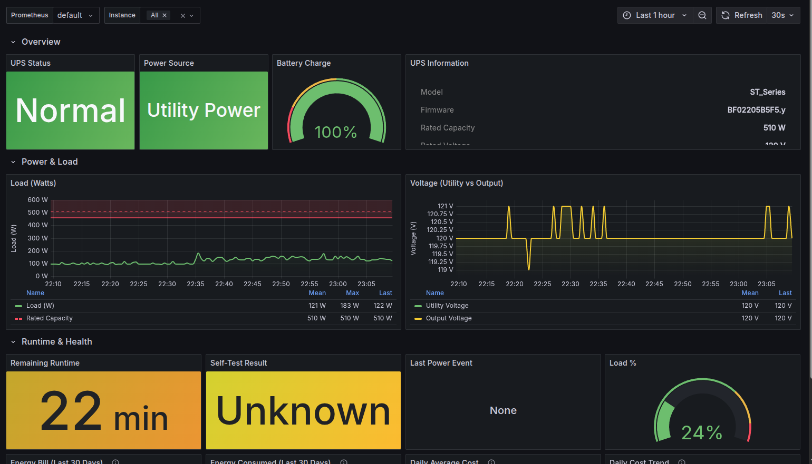

# pwrstat-node-exporter

Prometheus exporter for CyberPower UPS. One command to install.

## Install

```bash
curl -fsSL https://raw.githubusercontent.com/simran2491/pwrstat-node-exporter/main/install.sh | sudo bash
```

That's it. The installer will:
- ✅ Download the exporter from this repo
- ✅ Install it to `/opt/pwrstat-node-exporter/`
- ✅ Set up a systemd service
- ✅ Enable it to start on boot
- ✅ Verify metrics are working

### Install Specific Version

```bash
curl -fsSL https://raw.githubusercontent.com/simran2491/pwrstat-node-exporter/main/install.sh | sudo bash -s -- --version v1.0.0
```

## Prerequisites

1. **CyberPower UPS** connected via USB
2. **PowerPanel for Linux** installed (provides `pwrstat` command)
   - Download: https://www.cyberpowersystems.com/products/software/powerpanel-linux/
3. **Python 3** (usually pre-installed)

## Uninstall

```bash
curl -fsSL https://raw.githubusercontent.com/simran2491/pwrstat-node-exporter/main/uninstall.sh | sudo bash
```

## What It Monitors

| Metric | Description |
|--------|-------------|
| `pwrstat_state` | UPS state (1=Normal, 0=On Battery, -1=Unknown) |
| `pwrstat_battery_capacity_percent` | Battery charge percentage |
| `pwrstat_remaining_runtime_minutes` | Estimated runtime on battery |
| `pwrstat_load_watts` | Current load in watts |
| `pwrstat_load_percent` | Load as percentage of capacity |
| `pwrstat_utility_voltage_volts` | Input voltage from utility |
| `pwrstat_output_voltage_volts` | UPS output voltage |
| `pwrstat_power_source` | Power source (1=Utility, 0=Battery) |
| `pwrstat_test_result` | Last self-test result (1=Pass, 0=Fail) |
| `pwrstat_last_power_event_info` | Last power event info |

## Configure Prometheus Scrape

Add to your `kube-prometheus-stack` Helm values:

```yaml
prometheus:
  prometheusSpec:
    additionalScrapeConfigs:
      - job_name: 'pwrstat-exporter'
        scrape_interval: 30s
        static_configs:
          - targets: ['<NODE_IP>:9182']
            labels:
              instance: 'master-ups'
```

Replace `<NODE_IP>` with your host IP (e.g., `10.0.0.219`).

## Verify

```bash
# Check service
systemctl status pwrstat-exporter

# View metrics
curl http://localhost:9182/metrics

# Logs
journalctl -u pwrstat-exporter -f
```

## Example Metrics

```prometheus
# HELP pwrstat_state UPS state (1=Normal, 0=On Battery, -1=Unknown)
# TYPE pwrstat_state gauge
pwrstat_state 1

# HELP pwrstat_battery_capacity_percent Battery charge percentage
# TYPE pwrstat_battery_capacity_percent gauge
pwrstat_battery_capacity_percent 100

# HELP pwrstat_load_watts Current load in watts
# TYPE pwrstat_load_watts gauge
pwrstat_load_watts 127
```

## Grafana Dashboard

A pre-built dashboard is included in this repo. Import it into Grafana:

1. Go to **Dashboards** → **Import**
2. Upload `grafana-dashboard.json`
3. Select your Prometheus datasource



**Dashboard features:**
- UPS status, power source, and battery charge overview
- Real-time load and voltage time series
- Runtime, self-test, and power event panels
- Energy cost tracking (30-day bill, daily average, trend) at $0.10/kWh

## Alerting Rules

Add to Prometheus stack:

```yaml
additionalPrometheusRulesMap:
  ups-alerts:
    groups:
      - name: ups_alerts
        rules:
          - alert: UPSOnBattery
            expr: pwrstat_power_source == 0
            for: 1m
            labels:
              severity: warning
            annotations:
              summary: "UPS running on battery"

          - alert: UPSBatteryLow
            expr: pwrstat_battery_capacity_percent < 20
            for: 5m
            labels:
              severity: critical
            annotations:
              summary: "UPS battery at {{ $value }}%"

          - alert: UPSHighLoad
            expr: pwrstat_load_percent > 80
            for: 10m
            labels:
              severity: warning
            annotations:
              summary: "UPS load at {{ $value }}%"
```

## Troubleshooting

```bash
# Service not starting
systemctl status pwrstat-exporter
journalctl -u pwrstat-exporter -f

# pwrstat not found
which pwrstat
sudo pwrstat -status

# Check metrics endpoint
curl http://localhost:9182/metrics
curl http://localhost:9182/health
```

## Architecture

```
Linux Host (UPS via USB)        Kubernetes Cluster
┌──────────────────────┐        ┌──────────────────────┐
│ pwrstat CLI          │ scrape │ Prometheus Server    │
│      ↑               │◄───────│  :9182               │
│ pwrstat_exporter.py │        └──────────────────────┘
│ (systemd service)    │
└──────────────────────┘
```

## License

MIT
